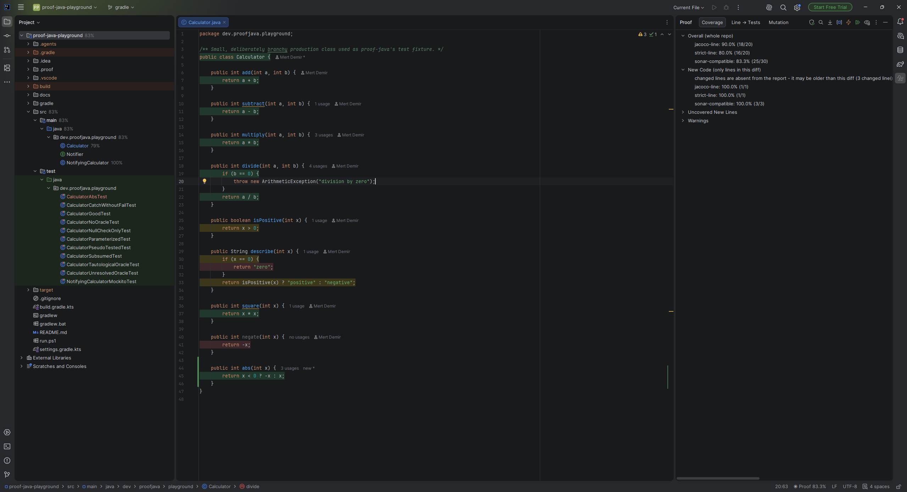
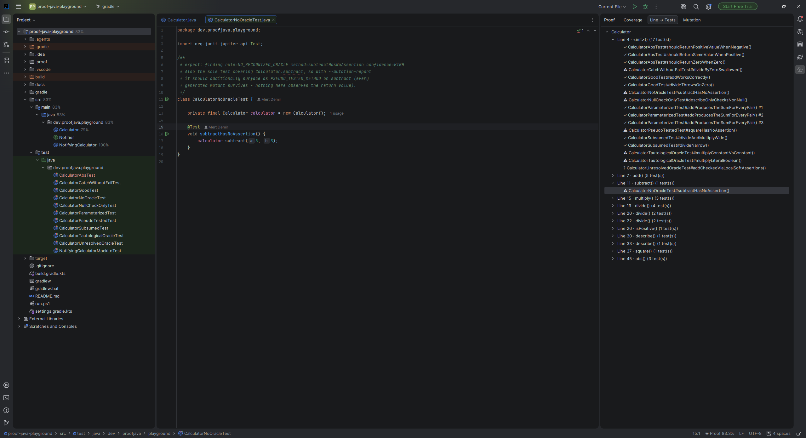
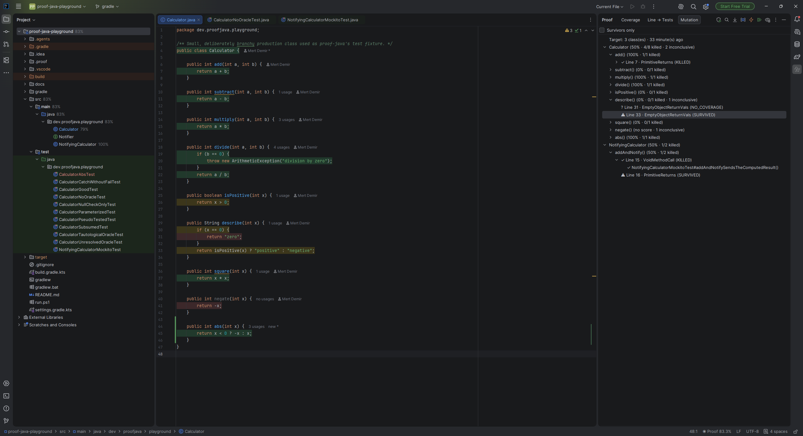

# Proof for IntelliJ IDEA

[](https://plugins.jetbrains.com/plugin/34152-proof)
[](https://plugins.jetbrains.com/plugin/34152-proof)

See which of your passing tests actually prove anything, right in the
editor.

Coverage tells you a line executed. It doesn't tell you that anything
checked what that line did. This plugin runs [proof-java](https://github.com/Metonya/proof-java)
against your project and shows its verdict directly in the editor: which
lines are covered, which of the tests covering them have no real
assertion, and which mutations nothing catches.

It's the IntelliJ IDEA counterpart to [proof-vscode](https://github.com/Metonya/proof-vscode)
- same CLI, same JSON contract, same underlying claims - built on the
IntelliJ Platform SDK instead of the VS Code extension API. Works in
IntelliJ IDEA Community and Ultimate.



## Why

A green test suite and a high coverage percentage both quietly assume the
same thing: that the code checking your program actually works. It's
common for that assumption to be wrong: a test with no assertion, a test
that compares a constant to itself, a test whose only checks sit inside a
`try` block that swallows the exception. All three run green. All three
raise your coverage number. None of them would catch a real bug.

Proof reads the evidence your build already produces (a JaCoCo report, your
git diff, and optionally a PIT mutation run) and turns it into specific
findings, shown where you're already looking: the editor gutter, a hover,
the Coverage tool window.

## Features

- **Coverage gutter**: inline, colored by line - covered, partially
  covered, uncovered, excluded, or *oracleless* (covered, but by tests
  with no real assertion), each with its own distinct color.
- **Project view badges** and a **status bar widget**, rolled up from the
  same data as the gutter.
- **Line → Tests**: for the file you have open, which tests cover a given
  line, and whether each one has a real oracle. In a test file, the same
  view runs in reverse, showing which production lines *this* test
  actually exercises.
- **Mutation testing**: run PIT against a single class (usually a few
  seconds, right-click a file → **Proof: Mutation Testing For This
  Class**) or a whole module (behind a confirmation, since it can run
  long). Results: class → method → mutant → the tests that failed to kill
  it, with a survivors-only filter.
- **Editor hover** with the same two directions as the Line → Tests view,
  right where you're looking.
- **Download proof-java.jar** and **Install Skill** commands, so getting
  set up doesn't require leaving the IDE or the browser.
- Every number comes from the CLI's own JSON. The plugin never parses
  coverage XML, runs git, or computes a percentage itself.

## Screenshots

**Coverage**: the gutter tint and the Coverage tool window's overall /
new-code / uncovered-lines breakdown, side by side as you edit.


**Line → Tests**: which tests cover this line, and whether each one has a
real oracle.



**Mutation**: class → method → mutant → the tests that failed to kill it,
with a survivors-only filter.



## Requirements

- IntelliJ IDEA Community or Ultimate, 2026.2 or newer.
- A Maven or Gradle project with a JaCoCo report. Quick Scan finds either
  `target/site/jacoco/jacoco.xml` (Maven) or
  `build/reports/jacoco/test/jacocoTestReport.xml` (Gradle) automatically.
  **Run Tests**, Deep Scan, and Mutation Testing all work for a plain-Java
  Gradle project too, provided it has a committed Gradle Wrapper
  (`gradlew`/`gradlew.bat`) - this plugin only ever runs a project's own
  pinned wrapper, never a bare `gradle` on `PATH`. See
  [`proof-java`](https://github.com/Metonya/proof-java)'s own README for
  the full build-tool support matrix (including Android/Kotlin gaps).
- `proof-java.jar`: the CLI this plugin runs. See
  [`proof-java`](https://github.com/Metonya/proof-java) for what it does
  and how it works. The plugin can fetch the jar for you (see Usage
  below); you never need to clone or build that repository yourself just
  to use this plugin.

## Installation

Search for **Proof** in **Settings/Preferences → Plugins → Marketplace**,
or install it from the [JetBrains Marketplace listing](https://plugins.jetbrains.com/plugin/34152-proof).

To build it from source instead:

```
git clone https://github.com/Metonya/proof-intellij.git
cd proof-intellij
./gradlew buildPlugin
```

This produces an installable `.zip` under `build/distributions/` -
install it via **Settings/Preferences → Plugins → ⚙ → Install Plugin from
Disk**. `./gradlew runIde` instead launches a sandboxed IntelliJ IDEA
instance with the plugin already installed, for trying it without
touching your own IDE.

## Usage

1. Open your project in IntelliJ IDEA and open the **Proof** tool window
   (right-hand tool window bar). If `proof-java.jar` isn't already on
   your machine, run **Tools → Proof → Download proof-java.jar**. It
   fetches the latest release from
   [`proof-java`](https://github.com/Metonya/proof-java), verifies it
   against the published checksum, and installs it somewhere the plugin
   already knows to look (no setting to configure). Already have a jar
   elsewhere? Point the `jarPath` setting at it instead.
2. Run **Quick Scan** for coverage and oracle findings, **Deep Scan** to
   also collect per-test line evidence, or right-click a file and choose
   **Proof: Mutation Testing For This Class** for mutation results on
   just that class.
3. Click through the Coverage / Line → Tests / Mutation tabs in the
   **Proof** tool window, or just read the gutter and hover over a line.
4. Want the `proof-java` skill installed for an AI coding agent (Claude
   Code, Windsurf, or any Cursor/Codex CLI/Gemini CLI/Copilot-compatible
   tool)? Run **Tools → Proof → Install Skill**.

## Configuration

Reachable at **Settings/Preferences → Tools → Proof**:

| Setting | Default | Purpose |
|---|---|---|
| `jarPath` | *(auto-detected)* | Path to `proof-java.jar`, if it isn't in one of the default locations |
| `javaExecutable` | *(auto-detected)* | Which `java` binary runs the CLI - defaults to the project's own configured SDK, then a bare `java` on `PATH` |
| `diffMode` | `uncommitted` | What counts as "changed": `no-vcs`, `uncommitted`, or `base` |
| `baseRef` | *(none)* | The ref to diff against when `diffMode` is `base` |

## Architecture

The project is split into three Gradle modules:

- `core` - language- and build-tool-agnostic: the verdict JSON contract,
  the CLI runner, and every UI surface (gutter, tool windows, status bar,
  hover wiring) that only ever consumes that JSON. `core` never imports
  anything from `engine-java` - enforced at compile time, not just by
  convention.
- `engine-java` - everything specific to Java, Maven, Gradle, JUnit, and
  PIT: build-tool detection, module discovery, classpath resolution,
  mutation testing, the `proof-java.jar`/skill fetchers, and the
  `JavaEngine` implementation of `core`'s `Engine` extension point.
- The root project applies the IntelliJ Platform Gradle plugin and holds
  `plugin.xml`, composing `core` and `engine-java` into one plugin
  artifact.

This mirrors a real split already implicit in
[`proof-vscode`](https://github.com/Metonya/proof-vscode)'s own source
tree, made structural here: a second engine for another language would
add a new module next to `engine-java`, not touch `core`.

## Documentation

- [proof-java](https://github.com/Metonya/proof-java): the CLI this
  plugin runs, and what each finding actually means.
- [`skills/proof-java`](https://github.com/Metonya/proof-java/tree/main/skills/proof-java):
  if you use an AI coding agent to write or repair tests, this is a skill
  for it. It runs `proof-java`, reads the verdict JSON, and acts on the
  findings in a loop instead of guessing whether a test is good.

## License

[Apache License 2.0](LICENSE), the same license as
[proof-java](https://github.com/Metonya/proof-java).
